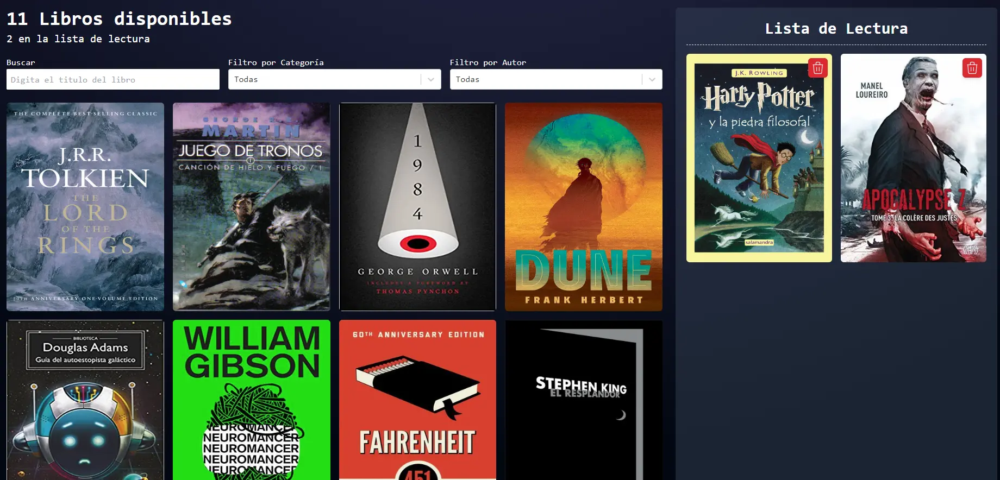

## Reading Book List Web
Aplicación que se realiza con el fin de diseñar e implementar una pequeña aplicación web de lista de libros empleando el stack
de desarrollo empleado por la organización de Jelou AI.



## Primeros Pasos

Para trabajar en el proyecto sin contratiempos deberías de seguir los siguientes pasos:

### Clona el proyecto asociado al repositorio de Github
```bash
git clone https://github.com/Gondax27/reading-list-web.git
```

### Revisión de la versión de Node.js
El proyecto fue desarrollado con la versión 20.13.1 de Node.js, se recomienda usar esta versión o versiones LTS superiores para el correcto funcionamiento del proyecto.
Para verificar tu versión de Node.js puedes ejecutar el comando:
```bash
node -v
```

### Instala las dependencias del proyecto
Una vez clonado el proyecto, accede a la carpeta en donde lo guardaste y en la consola de comandos digita:
```bash
npm install
```

### Ejecuta el proyecto localmente
Una vez tengas todas las dependencias instaladas, es momento de ejecutar el proyecto, para ejecutar de manera correcta el proyecto puedes ingresar el comando de:

```bash
npm run dev
```

Una vez ejecutado el comando ya puedes acceder al proyecto por medio de la URL de http://localhost:5173
