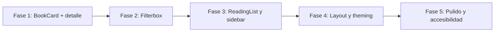

# Plan de Modernización UI — Reading List Web

- **Proyecto:** `reading-list-web`
- **Fecha:** 2026-08-30
- **Estado:** En progreso
- **Stack UI objetivo:** [shadcn/ui](https://ui.shadcn.com/) + Tailwind CSS v4 + Lucide React

---

## 1. Visión

Migrar progresivamente la capa visual de la aplicación desde componentes Tailwind escritos a mano hacia primitivos **shadcn/ui** (estilo `radix-nova`), manteniendo intacta la lógica de negocio (Zustand, TanStack Query, Open Library, persistencia en `localStorage`).

El objetivo es una UI más consistente, accesible y extensible, con patrones reutilizables para cards, formularios, overlays y navegación.

---

## 2. Estado actual

| Área | Estado |
| :--- | :--- |
| shadcn/ui base | Instalado (`components.json`, tokens CSS, `cn` helper) |
| Primitivos shadcn | `Button`, `Card`, `Badge`, `Tooltip`, `Dialog` |
| Vista principal (`AvailableBooks`) | Grid de portadas; clic en card añade a lista |
| `BookCard` | Solo imagen; sin metadatos ni acciones explícitas |
| Detalle de libro | No existe |
| Favoritos / lista de lectura | Un solo gesto (clic en card) |
| `Filterbox` | `react-select` custom con Tailwind |
| Sidebar / `ReadingList` | Tailwind manual |

---

## 3. Roadmap por fases

### Fase 1 — Vista principal y tarjetas de libro ✅ *Completada*

**Objetivo:** Mejorar la experiencia del catálogo con cards informativas y acciones claras.

- Rediseñar `BookCard` con `Card`, `Badge`, `Button`, `Tooltip`.
- Añadir `BookDetailDialog` (sinopsis, autor, año, páginas, género).
- Botón explícito **Añadir a favoritos** (lista de lectura).
- Botón **Ver detalles** que abre el diálogo.
- **Infinite scroll** con filtros server-side Open Library.

**SDD detallado:** [`docs/SDD-modernizacion-ui-shadcn.md`](./SDD-modernizacion-ui-shadcn.md) · [`docs/SDD-infinite-scroll-filters.md`](./SDD-infinite-scroll-filters.md)

### Fase 2 — Filtros (`Filterbox`)

- Sustituir o envolver `react-select` con `Select`, `Input` y `Label` de shadcn.
- Unificar estilos con tokens semánticos (`muted`, `border`, `ring`).
- Mejorar accesibilidad de filtros por autor, categoría y búsqueda.

### Fase 3 — Lista de lectura y sidebar

- Migrar `ReadingList` y `Sidebar` a `Sheet` / `Drawer` de shadcn.
- Reutilizar `BookCard` y `BookDetailDialog` en ambos contextos.
- Empty states con componentes shadcn.

### Fase 4 — Layout global y theming

- Aplicar `dark` class o toggle de tema explícito.
- Header de app con tipografía y espaciado unificados.
- Skeleton loaders para carga de libros (`Skeleton`).

### Fase 5 — Pulido

- Revisión de accesibilidad (ARIA, foco, teclado).
- Animaciones coherentes con `tw-animate-css`.
- Documentación de componentes de dominio en `docs/`.

---

## 4. Principios de migración

1. **Incremental:** Cada fase entrega valor visible sin bloquear la app.
2. **Schema-first:** Tipos en `src/types/` antes de UI cuando aplique.
3. **Sin regresiones:** Persistencia, filtros y API Open Library intactos.
4. **Biome + build:** Cada fase debe pasar `npm run check`, `npm run test` y `npm run build`.
5. **Primitivos en `ui/`, dominio en `components/`:** No mezclar responsabilidades.

---

## 5. Componentes shadcn previstos

| Fase | Componentes |
| :--- | :--- |
| 1 | `card`, `dialog`, `badge`, `button`, `tooltip` |
| 2 | `input`, `label`, `select` |
| 3 | `sheet`, `separator`, `scroll-area` |
| 4 | `skeleton`, `sonner` (toasts opcionales) |
| 5 | Revisión y ajustes menores |

---

## 6. Criterios de éxito global

- [ ] Toda la UI de producto usa primitivos shadcn donde corresponda.
- [ ] Experiencia móvil y desktop consistente.
- [ ] Acciones de favoritos y detalle accesibles por teclado.
- [ ] CI verde en lint, tests y build.
- [ ] SDD actualizado por cada fase completada.

---

## 7. Referencias

- [SDD instalación shadcn](./SDD-install-shadcn.md)
- [SDD modernización UI — Fase 1](./SDD-modernizacion-ui-shadcn.md)
- [AGENTS.md](../AGENTS.md)
