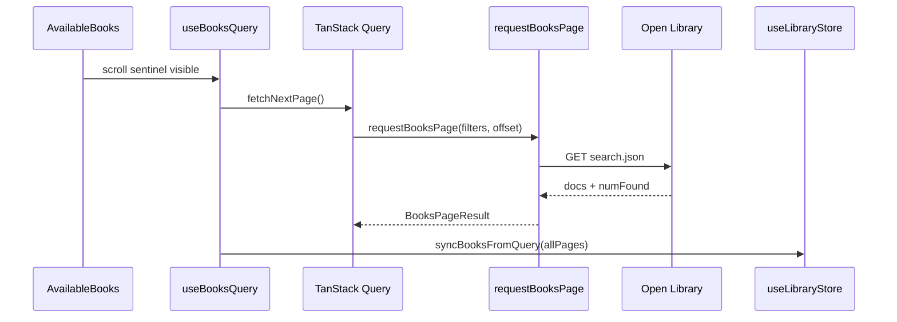

# SDD: Infinite Scroll y Filtros Server-Side (Open Library)

- **Documento:** Software Design Document (SDD)
- **Proyecto:** `reading-list-web`
- **Estado:** Implementado
- **Fecha:** 2026-08-30
- **Versión:** 1.0.0
- **Plan maestro:** [`MODERNIZACION-UI.md`](./MODERNIZACION-UI.md)

---

## 1. Objetivo

Reemplazar la carga única de 30 libros y el filtrado client-side por:

1. **Infinite scroll** con TanStack Query `useInfiniteQuery`.
2. **Filtros server-side** traducidos a consultas Solr de Open Library.
3. **Persistencia robusta** de la lista de lectura (objetos `Book` completos).

---

## 2. Arquitectura

---

## 3. Filtros soportados

| Filtro UI | Parámetro Solr | Notas |
| :--- | :--- | :--- |
| Materia / Género | `subject:` (difusa) | Default `subject:fiction`; ver [OPEN-LIBRARY-API.md](./OPEN-LIBRARY-API.md) |
| Idioma | `language:` (ISO 639-2) + `lang` (ISO 639-1) | Exclusión + preferencia de edición |
| Autor | `author:` | Parcial; entre comillas si tiene espacios |
| Búsqueda | texto libre en `q` | Mínimo 3 caracteres |
| Año desde/hasta | `first_publish_year:[X TO Y]` | Opcional |
| Acceso ebook | `ebook_access:` | `public`, `borrowable`, `no_ebook` |
| Orden | `sort` | `new`, `old`, `random`, `relevance` |

Paginación: `limit=30`, `offset` acumulativo por página.

---

## 4. Criterios de aceptación

- [x] Scroll infinito carga páginas adicionales automáticamente.
- [x] Cambiar filtros reinicia la query (`queryKey: ['books', filters]`).
- [x] Contador muestra libros cargados vs `numFound` total.
- [x] Lista de lectura persiste objetos completos en `localStorage`.
- [x] Tests y build pasan sin errores.
