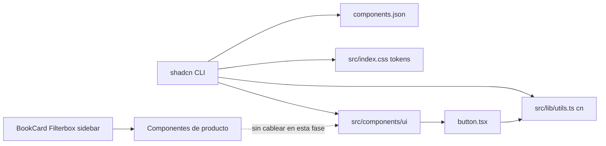
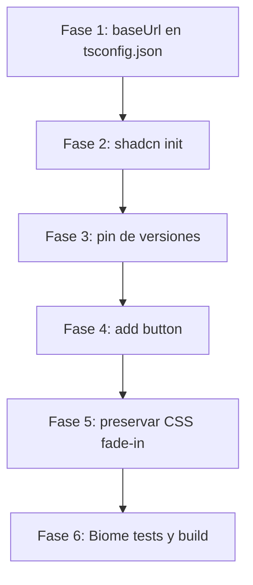

# SDD: Plan de Instalación Base de shadcn/ui

- **Documento:** Software Design Document (SDD)
- **Proyecto:** `reading-list-web`
- **Autor:** Development Team
- **Estado:** Propuesto / En Revisión
- **Fecha:** 2026-08-30
- **Versión del Documento:** 1.0.0

---

## 1. Resumen Ejecutivo y Objetivos

### 1.1 Contexto
`reading-list-web` es una SPA con React 19, Vite 8, TypeScript estricto, Tailwind CSS v4 (`@tailwindcss/vite`), Zustand 5 y TanStack Query v5. El linting y el formateo se gestionan con Biome. Las versiones de npm están fijadas (sin `^` ni `~`).

La UI de producto (`BookCard`, `Filterbox`, `AvailableBooks`, sidebar) está escrita a mano con Tailwind. Para estandarizar primitivos de diseño (botones, overlays, formularios) sin acoplar aún la UI existente, se integrará **shadcn/ui** como sistema de componentes copiados al repositorio (no como paquete opaco único).

El flujo oficial aplicable es el de **proyecto Vite existente**: [Installation / Vite](https://ui.shadcn.com/docs/installation/vite). **No** se usará `npx shadcn@latest init -t vite`, porque ese flag scaffolda un proyecto Vite nuevo.

### 1.2 Objetivos Principales
1. Inicializar shadcn/ui en el repo existente con `npx shadcn@latest init`.
2. Dejar `components.json` alineado con Tailwind v4, React SPA (`rsc: false`) y el alias `@/*`.
3. Añadir `src/lib/utils.ts` con el helper `cn` (`clsx` + `tailwind-merge`).
4. Crear `src/components/ui/` y añadir un único componente de humo: `Button`.
5. Pinnear en `package.json` todas las dependencias que instale el CLI.
6. Conservar la animación `fade-in` actual en `src/index.css`.

### 1.3 Fuera de Alcance (Non-Goals)
- No se rediseñará ni reemplazará `BookCard`, `Filterbox`, `AvailableBooks` ni el sidebar.
- No se cableará `Button` (ni ningún otro primitivo shadcn) a la UI de producto en esta instalación.
- No se cambiarán reglas de negocio, filtros, Open Library ni persistencia (`localStorage` / TanStack Query).
- No se creará `tsconfig.app.json`: este repositorio resuelve la app con `tsconfig.json` + `tsconfig.node.json`.

---

## 2. Estado Actual vs. Prerrequisitos Oficiales

| Prerrequisito shadcn (Vite existente) | Estado en `main` | Acción |
| :--- | :--- | :--- |
| Tailwind CSS v4 + `@tailwindcss/vite` | Presente en `vite.config.ts` y `package.json` (`4.3.3`) | Ninguna |
| `@import "tailwindcss"` en CSS global | Presente en `src/index.css` | Conservar; el CLI añadirá imports/tokens |
| Alias `@` en Vite | Presente (`path.resolve(import.meta.dirname, './src')`) | Ninguna |
| `compilerOptions.paths` `@/*` → `./src/*` | Presente en `tsconfig.json` | Completar con `baseUrl` |
| `compilerOptions.baseUrl` | **Ausente** | Añadir `"."` |
| `tsconfig.app.json` | No existe (no aplica) | No crear |
| `@types/node` | Presente (`26.4.0`) | Ninguna |
| `components.json` | No existe | Lo genera `init` |
| `src/lib/utils.ts` | No existe | Lo genera `init` |
| `src/components/ui/` | No existe | Lo crea `add button` |

### 2.1 Ajuste mínimo de TypeScript
Antes de `init`, añadir `baseUrl` para que el CLI y el editor resuelvan `@/`:

```json
{
  "compilerOptions": {
    "baseUrl": ".",
    "paths": {
      "@/*": ["./src/*"]
    }
  }
}
```

El resto de `compilerOptions` de `tsconfig.json` no se modifica.

---

## 3. Arquitectura de Integración



### 3.1 Convención de carpetas
- `src/components/` sigue siendo la capa de presentación de dominio (`BookCard`, `Filterbox`, etc.).
- `src/components/ui/` queda reservada a primitivos generados por shadcn.
- `src/hooks/` ya existe; el alias `hooks` de `components.json` apuntará a `@/hooks` sin sobrescribir hooks actuales.
- `src/lib/` es nueva y se limita a utilidades de UI (`cn`). No mover servicios ni stores ahí.

### 3.2 Especificación de `components.json`
Valores objetivo (el CLI debe producir un equivalente; no reescribir a mano salvo corrección de rutas):

```json
{
  "$schema": "https://ui.shadcn.com/schema.json",
  "style": "new-york",
  "rsc": false,
  "tsx": true,
  "tailwind": {
    "config": "",
    "css": "src/index.css",
    "baseColor": "neutral",
    "cssVariables": true,
    "prefix": ""
  },
  "aliases": {
    "components": "@/components",
    "utils": "@/lib/utils",
    "ui": "@/components/ui",
    "lib": "@/lib",
    "hooks": "@/hooks"
  },
  "iconLibrary": "lucide"
}
```

Justificación:
- **`style: new-york`**: estilo vigente; `default` está deprecado.
- **`rsc: false`**: SPA Vite, sin React Server Components.
- **`tailwind.config: ""`**: Tailwind v4 no usa `tailwind.config.js`.
- **`cssVariables: true`**: theming semántico (`background`, `foreground`, `primary`).
- **`baseColor: neutral`**: paleta neutra, compatible con el look actual de la app.

### 3.3 Helper `cn` (`src/lib/utils.ts`)
El CLI debe generar (o equivalente tipado):

```ts
import { type ClassValue, clsx } from 'clsx';
import { twMerge } from 'tailwind-merge';

export function cn(...inputs: ClassValue[]) {
  return twMerge(clsx(inputs));
}
```

Tras `init`/`add`, Biome reformateará a comillas simples.

### 3.4 CSS global
El CLI inyectará, entre otros:

- `@import "tw-animate-css";`
- `@import "shadcn/tailwind.css";`
- `@custom-variant dark (&:is(.dark *));`
- Tokens en `:root` / `.dark` y mapeo `@theme inline`

**Obligatorio:** no eliminar `@keyframes fade-in` ni `.animation-fade-in`. Concatenar el tema shadcn **después** de `@import "tailwindcss";` y **antes o después** del bloque de animación existente, sin sustituir el archivo entero.

---

## 4. Dependencias Esperadas y Pinning

shadcn no se consume solo como librería opaca: el CLI copia componentes y añade paquetes de soporte. Tras `init` y `add button`, se espera (nombres; las versiones exactas se fijarán con lo que resuelva npm en el momento de la implementación):

### 4.1 Producción (típicas)
- `shadcn`
- `class-variance-authority`
- `clsx`
- `tailwind-merge`
- `lucide-react`
- `tw-animate-css`
- Primitivos Radix que requiera `Button` (p. ej. `@radix-ui/react-slot`), si el CLI los instala

### 4.2 Gobernanza de versiones
1. Dejar que el CLI instale.
2. Editar `package.json` y quitar `^` / `~` de **todas** las entradas nuevas.
3. Ejecutar `npm install` para alinear `package-lock.json` con versiones fijas.
4. No relajar el pinning del resto del stack (React 19.2.8, Vite 8.2.2, Tailwind 4.3.3, Biome 2.5.11, etc.).

---

## 5. Plan de Ejecución por Fases

Esta sección describe la **implementación futura**. Esta rama (`docs/sdd-install-shadcn`) solo entrega el SDD.



### Fase 1: Preparación de TypeScript
- Añadir `"baseUrl": "."` en `compilerOptions` de `tsconfig.json`.

### Fase 2: Inicialización
Desde la raíz del repo (npm, no pnpm):

```bash
npx shadcn@latest init
```

Respuestas / flags alineados a este SDD:
- Proyecto existente (no template Vite nuevo)
- TypeScript: sí
- RSC: no
- Style: New York
- Base color: Neutral
- CSS variables: sí
- Iconos: Lucide
- CSS: `src/index.css`

Si el CLI ofrece flags no interactivos equivalentes (`--yes` y opciones de preset), usarlos solo si el resultado coincide con la sección 3.2.

### Fase 3: Pinning
- Revisar `package.json`.
- Fijar versiones nuevas.
- Regenerar lockfile con `npm install`.

### Fase 4: Componente de humo
```bash
npx shadcn@latest add button
```

En la implementación se podrá importar temporalmente en un archivo de desarrollo **o** verificar solo que `src/components/ui/button.tsx` compile. **No** sustituir botones de `BookCard` / sidebar.

### Fase 5: CSS
- Confirmar que `fade-in` sigue en `src/index.css`.
- Restaurar el bloque si el CLI lo borró.

### Fase 6: Calidad
1. `npm run check:fix` — el CLI suele generar comillas dobles; Biome debe dejar el repo en el estilo del proyecto.
2. `npm run test`
3. `npm run build`

---

## 6. Criterios de Aceptación (implementación futura)

- [ ] Existe `components.json` con `rsc: false`, `tailwind.config` vacío y `css: src/index.css`.
- [ ] `tsconfig.json` incluye `baseUrl: "."` y el alias `@/*`.
- [ ] Existe `src/lib/utils.ts` exportando `cn`.
- [ ] Existe `src/components/ui/button.tsx` importable como `@/components/ui/button`.
- [ ] `src/index.css` conserva `@keyframes fade-in` y `.animation-fade-in`.
- [ ] Las dependencias nuevas están pinneadas (sin `^` ni `~`).
- [ ] `BookCard`, `Filterbox` y el sidebar no usan componentes shadcn.
- [ ] `npm run check`, `npm run test` y `npm run build` pasan con 0 errores.

---

## 7. Aprobación y Siguientes Pasos

Una vez validado este SDD v1.0, la implementación se hará en una rama semántica distinta (`feat/install-shadcn`), siguiendo las fases 1–6 y abriendo PR hacia `main`.
