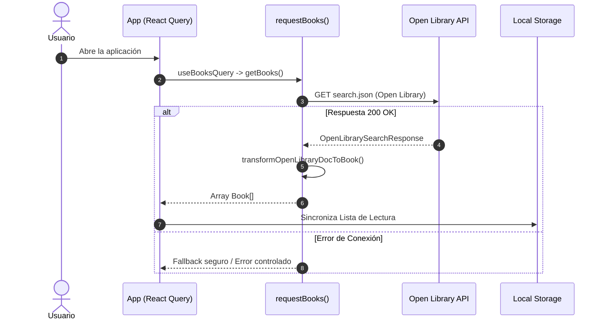

# SDD: Migración del Servicio de Libros a Open Library API

- **Documento:** Software Design Document (SDD)
- **Proyecto:** `reading-list-web`
- **Autor:** Antigravity & Development Team
- **Estado:** Propuesto / En Revisión
- **Fecha:** 2026-08-30
- **Versión del Documento:** 1.0.0

---

## 1. Resumen Ejecutivo y Objetivos

### 1.1 Contexto
El servicio original de obtención de libros (`https://jelou-prueba-tecnica1-frontend.rsbmk.workers.dev`) ha sido dado de baja definitivamente, provocando que la aplicación falle al intentar cargar la lista inicial.

Para resolverlo de forma definitiva y robusta, migraremos el proveedor de datos a **Open Library API** (`openlibrary.org`), una base de datos bibliográfica abierta, pública y mantenida por Internet Archive.

### 1.2 Objetivos Principales
1. **Migrar el Endpoint de Datos**: Reemplazar la URL anterior por la API pública de Open Library Search.
2. **Transformación y Normalización Robusta**: Mapear el esquema de respuesta de Open Library al contrato de dominio `Book` sin alterar los componentes visuales ni el store de Zustand.
3. **Optimización de Portadas e Imágenes**: Emplear el CDN de Open Library Covers (`covers.openlibrary.org`) con resoluciones optimizadas y fallback SVG ante portadas inexistentes.
4. **Resiliencia y Fallback Graceful**: Manejo de errores controlado ante fallos de conexión.
5. **Compatibilidad Total**: Mantener el filtrado por título, autor, género y la sincronización con `localStorage`.

### 1.3 Fuera de Alcance (Non-Goals)
- No se alterará el diseño ni la estructura de componentes visuales (`BookCard`, `Filterbox`, `ReadingList`, `AvailableBooks`).
- No se modificará la API pública del hook `useBooksQuery`.

---

## 2. Análisis Técnico de la API de Open Library

### 2.1 Endpoint Seleccionado
Se utilizará el endpoint de búsqueda con proyección de campos (*field projection*):

```http
GET https://openlibrary.org/search.json?q=language:spa+OR+language:eng&subject=fiction&fields=key,title,author_name,first_publish_year,number_of_pages_median,isbn,cover_i,subject,first_sentence&limit=30
```

### 2.2 Características:
- **Payload Ligero**: Solo descarga los campos solicitados en `fields=...`.
- **CDN de Portadas**: `https://covers.openlibrary.org/b/id/{cover_i}-M.jpg` o `https://covers.openlibrary.org/b/isbn/{isbn}-M.jpg`.

---

## 3. Contratos de Datos y Mapeo (Schema-First)

### 3.1 Esquema de Open Library (`OpenLibraryDoc`)
```ts
export interface OpenLibraryDoc {
  key: string;
  title: string;
  author_name?: string[];
  first_publish_year?: number;
  number_of_pages_median?: number;
  isbn?: string[];
  cover_i?: number;
  subject?: string[];
  first_sentence?: string[];
}

export interface OpenLibrarySearchResponse {
  numFound: number;
  start: number;
  docs: OpenLibraryDoc[];
}
```

### 3.2 Contrato de Dominio (`Book`)
```ts
export interface Book {
  title: string;
  pages: number;
  genre: string;
  cover: string;
  synopsis: string;
  year: number;
  ISBN: string;
  author: {
    name: string;
    otherBooks: string[];
  };
}
```

### 3.3 Mapeo y Normalización:
| Campo `Book` | Origen Open Library | Normalización |
| :--- | :--- | :--- |
| `title` | `doc.title` | Título del libro. |
| `ISBN` | `doc.isbn[0]` | Primer ISBN o key de la obra. |
| `pages` | `doc.number_of_pages_median` | Páginas estimadas o 280 por defecto. |
| `year` | `doc.first_publish_year` | Año de primera publicación o año actual. |
| `genre` | `doc.subject` | Normalización a categorías clave (Fantasía, Ciencia Ficción, Terror, Misterio, Romance, Historia, Ficción). |
| `cover` | `doc.cover_i` / `doc.isbn` | URL de CDN de Open Library con fallback visual. |
| `synopsis` | `doc.first_sentence` | Primera oración o resumen temático. |
| `author.name` | `doc.author_name[0]` | Nombre del primer autor o "Autor Anónimo". |

---

## 4. Arquitectura de la Capa de Servicios (`src/services/library.ts`)



---


---

## 5. Estrategia de Caché y Optimización con TanStack Query v5

Para maximizar el rendimiento, reducir llamadas innecesarias a Open Library y permitir navegación instantánea:

### 5.1 Configuración de Políticas de Caché
En `src/main.tsx` y `src/hooks/useBooksQuery.ts`:

```ts
const queryClient = new QueryClient({
  defaultOptions: {
    queries: {
      staleTime: 1000 * 60 * 60 * 24, // 24 Horas: Los libros no cambian frecuentemente
      gcTime: 1000 * 60 * 60 * 24 * 7, // 7 Días en memoria de recolector
      refetchOnWindowFocus: false,
      refetchOnReconnect: false,
      retry: 2,
      retryDelay: (attemptIndex) => Math.min(1000 * 2 ** attemptIndex, 10000),
    },
  },
});
```

### 5.2 Beneficios:
1. **Zero Redundant Fetches**: La petición a Open Library solo se ejecuta una vez por sesión, evitando sobrecargar la API pública y eliminando spinners en re-renders.
2. **Navegación Instantánea**: Al cambiar entre vistas o filtros, los datos se sirven directamente de la memoria caché de React Query.
3. **Resiliencia ante Fallos**: Reintentos automáticos con retroceso exponencial (*exponential backoff*).

## 6. Plan de Implementación por Fases

### Fase 1: Especificación y Contratos de Tipos
- Definir `OpenLibraryDoc` y `OpenLibrarySearchResponse` en `src/types/library.ts`.

### Fase 2: Implementación de la Capa de Servicios
- Actualizar `src/services/library.ts` implementando `requestBooks` con la API de Open Library y el transformador de datos.

### Fase 3: Pruebas Funcionales y de Filtros
- Validar que los filtros por búsqueda, autor y categoría se pueblen y funcionen en la UI.
- Validar sincronización con `localStorage`.

### Fase 4: Calidad y Verificación CI
- Ejecutar `npm run check:fix` (Biome).
- Ejecutar `npm run build` (Vite 8 + TypeScript).

### Fase 5: Creación de Rama, Commit y Pull Request
- Crear rama semántica `feat/migrate-to-open-library-api`.
- Realizar commit y PR hacia `main`.

---

## 7. Criterios de Aceptación

- [ ] Carga exitosa de catálogo de libros desde Open Library.
- [ ] Portadas visualizadas correctamente con CDN de Open Library.
- [ ] Filtro por título funcionando en tiempo real.
- [ ] Selectores de autor y categoría poblados dinámicamente.
- [ ] Persistencia de lista de lectura en `localStorage`.
- [ ] 0 errores en `npm run check` y `npm run build`.
