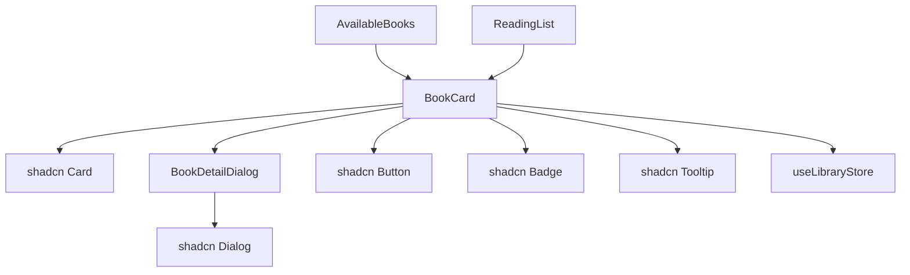
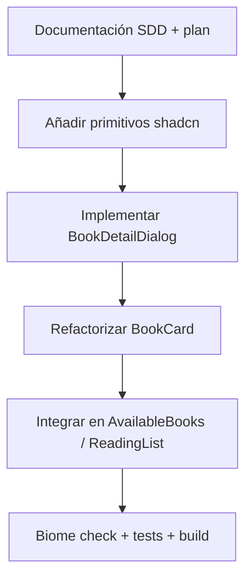

# SDD: Modernización UI con shadcn/ui — Fase 1 (BookCard y detalle)

- **Documento:** Software Design Document (SDD)
- **Proyecto:** `reading-list-web`
- **Autor:** Development Team
- **Estado:** En implementación
- **Fecha:** 2026-08-30
- **Versión del Documento:** 1.0.0
- **Plan maestro:** [`MODERNIZACION-UI.md`](./MODERNIZACION-UI.md)

---

## 1. Resumen Ejecutivo y Objetivos

### 1.1 Contexto

La vista principal (`AvailableBooks`) muestra un grid de portadas mediante `BookCard`. Añadir un libro a la lista de lectura requiere hacer clic en toda la card, sin feedback visual de metadatos ni forma de consultar la sinopsis. La instalación base de shadcn/ui ya está operativa (`components.json`, tokens, `Button`).

### 1.2 Objetivos de la Fase 1

1. Rediseñar `BookCard` usando primitivos shadcn (`Card`, `Badge`, `Button`, `Tooltip`).
2. Introducir `BookDetailDialog` para consultar detalles completos del libro.
3. Ofrecer acciones explícitas: **Añadir a favoritos** y **Ver detalles**.
4. Preservar la variante `reading-list` con eliminación y acceso a detalle.
5. No alterar contratos de `LibraryStore` ni persistencia en `localStorage`.

### 1.3 Fuera de Alcance (Non-Goals)

- Migración de `Filterbox`, sidebar o layout global (Fases 2–4).
- Nuevo concepto de "favoritos" separado de la lista de lectura.
- Cambios en la API Open Library o en el modelo `Book`.
- Toasts / notificaciones de confirmación (evaluable en Fase 5).

---

## 2. Diseño de Componentes

### 2.1 Diagrama de composición



### 2.2 `BookCard` — Variante `available-list`

| Elemento | Comportamiento |
| :--- | :--- |
| Portada | Imagen con fallback; alt descriptivo; lazy loading según índice |
| Título | `CardTitle`, truncado a 2 líneas |
| Autor | `CardDescription` |
| Género | `Badge` variant `secondary` |
| Botón favoritos | Icono `BookmarkPlus`; llama `addReadingBook`; tooltip |
| Botón detalles | Icono `Info`; abre `BookDetailDialog` |
| Interacción | **No** clic en toda la card |

### 2.3 `BookCard` — Variante `reading-list`

| Elemento | Comportamiento |
| :--- | :--- |
| Portada | Misma lógica de imagen |
| Botón eliminar | `Button` variant `destructive` size `icon-sm` |
| Botón detalles | Igual que en available-list |
| Botón quitar de lista | También disponible dentro del diálogo de detalle |

### 2.4 `BookDetailDialog`

Props:

```ts
interface BookDetailDialogProps {
  book: Book;
  open: boolean;
  onOpenChange: (open: boolean) => void;
  mode: 'available' | 'reading-list';
  onAdd?: (book: Book) => void;
  onRemove?: (book: Book) => void;
}
```

Contenido del diálogo:

- Portada (lado izquierdo en desktop, arriba en móvil).
- Título, autor, año, páginas, ISBN, género (`Badge`).
- Sinopsis completa.
- Lista de otros libros del autor (si `otherBooks.length > 0`).
- Footer con CTA según `mode`:
  - `available`: "Añadir a mi lista" → `onAdd` + cierra diálogo.
  - `reading-list`: "Quitar de mi lista" → `onRemove` + cierra diálogo.

---

## 3. Contratos de Tipos

No se modifican `Book`, `Author` ni `LibraryStore`. El estado del diálogo es **local** en cada `BookCard` (`useState<boolean>`), evitando ampliar `UIStore` en esta fase.

---

## 4. Componentes shadcn requeridos

| Componente | Ruta | Estado |
| :--- | :--- | :--- |
| `button` | `src/components/ui/button.tsx` | Existente |
| `card` | `src/components/ui/card.tsx` | Añadido |
| `badge` | `src/components/ui/badge.tsx` | Añadido |
| `tooltip` | `src/components/ui/tooltip.tsx` | Añadido |
| `dialog` | `src/components/ui/dialog.tsx` | Añadido |

`TooltipProvider` se montará en `AvailableBooks` y `ReadingList` (o en `App`) para habilitar tooltips en el grid.

---

## 5. Cambios en archivos existentes

| Archivo | Cambio |
| :--- | :--- |
| `src/components/BookCard.tsx` | Reescritura con shadcn |
| `src/components/BookDetailDialog.tsx` | **Nuevo** |
| `src/components/AvailableBooks.tsx` | `TooltipProvider`; grid gap ajustado |
| `src/components/ReadingList.tsx` | `TooltipProvider` |
| `src/index.css` | Sin cambios estructurales |

---

## 6. Plan de Ejecución



### Fase A — Primitivos
- Añadir `card`, `badge`, `tooltip`, `dialog` vía CLI o manual si el registry falla.

### Fase B — Implementación
- Crear `BookDetailDialog.tsx`.
- Refactorizar `BookCard.tsx` con acciones explícitas.

### Fase C — Integración
- Envolver grids con `TooltipProvider`.
- Ajustar clases del grid (`gap-6`) para cards más altas.

### Fase D — Calidad
1. `npm run check:fix`
2. `npm run test`
3. `npm run build`

---

## 7. Criterios de Aceptación

- [ ] Cada libro en el catálogo muestra título, autor y género en la card.
- [ ] Existe botón accesible para añadir a la lista de lectura (con `aria-label`).
- [ ] Existe botón para abrir detalles en un `Dialog`.
- [ ] El diálogo muestra sinopsis y metadatos completos.
- [ ] Desde el diálogo se puede añadir o quitar el libro según contexto.
- [ ] La variante `reading-list` conserva eliminación rápida.
- [ ] No hay regresión en filtros ni persistencia `localStorage`.
- [ ] `npm run check`, `npm run test` y `npm run build` pasan con 0 errores.

---

## 8. Riesgos y mitigaciones

| Riesgo | Mitigación |
| :--- | :--- |
| Registry shadcn `radix-nova` intermitente | Crear `dialog.tsx` manualmente desde el JSON oficial |
| Cards más altas rompen layout | Ajustar `grid` y `gap`; probar breakpoints |
| Doble Provider de Tooltip | Un solo `TooltipProvider` por sección |

---

## 9. Siguientes pasos (Fase 2)

Una vez aprobada e integrada la Fase 1, continuar con la migración de `Filterbox` a componentes shadcn (`Input`, `Select`, `Label`) según [`MODERNIZACION-UI.md`](./MODERNIZACION-UI.md).
