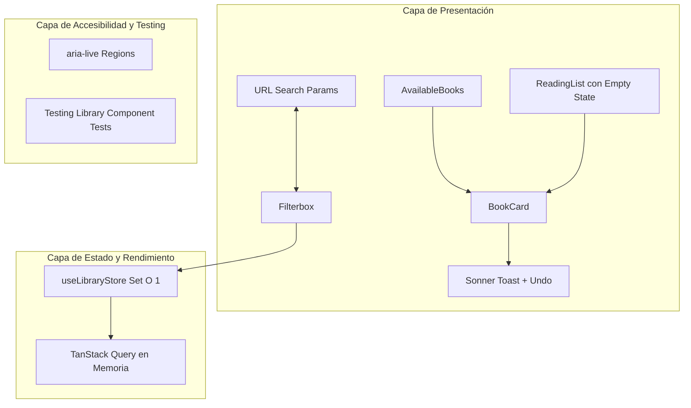
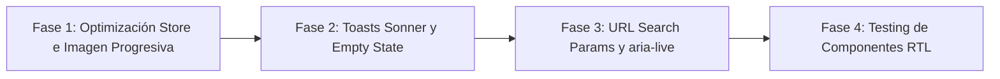

# SDD: Mejoras de UX, Rendimiento, Accesibilidad y Calidad

- **Documento:** Software Design Document (SDD)
- **Proyecto:** `reading-list-web`
- **Autor:** Development Team
- **Estado:** Propuesto
- **Fecha:** 2026-08-30
- **Versión del Documento:** 1.0.0

---

## 1. Resumen Ejecutivo y Objetivos

### 1.1 Contexto

Tras la modernización de filtros con Popover (shadcn/ui), la estandarización de tokens semánticos (modo claro/oscuro), la unificación visual de `BookCard` y la adopción de `Skeleton` para los estados de carga, se identificaron áreas de mejora clave para consolidar la arquitectura, robustecer la experiencia de usuario y garantizar la cobertura de pruebas del frontend.

### 1.2 Objetivos Principales

1. **Persistencia y Navegabilidad en URL (`URLSearchParams`)**: Sincronizar bidireccionalmente los filtros de búsqueda con la URL del navegador.
2. **Gestión Avanzada y Empty State en Reading List**: Proporcionar un estado vacío explicativo, estados de lectura (*Por leer* / *Leído*) y capacidad de exportar la lista.
3. **Feedback Inmediato con Toasts (shadcn Sonner)**: Notificar visualmente la adición/remoción de libros con soporte de acción rápida *"Deshacer"* (*Undo*).
4. **Optimización de Rendimiento en `LibraryStore`**: Acelerar el cálculo de libros disponibles mediante conjuntos indexados `Set<string>` ($\mathcal{O}(1)$).
5. **Carga Progresiva de Portadas**: Eliminar saltos visuales de render (*Layout Shift*) con transiciones suaves de imagen.
6. **Pruebas de Componentes React**: Implementar tests unitarios y de integración para componentes con `@testing-library/react`.
7. **Accesibilidad Semántica (`aria-live`)**: Informar cambios de estado en tiempo real a tecnologías asistivas.

### 1.3 Fuera de Alcance (Non-Goals)

- Atajos globales de teclado (*Keyboard Shortcuts*).
- Configuración de suite de pruebas End-to-End (E2E) con herramientas como Playwright o Cypress.
- Modificación del backend o de los endpoints de la API de Open Library.

---

## 2. Arquitectura y Especificación Técnica



---

## 3. Especificación Detallada por Módulo

### 3.1 Sincronización de Filtros en la URL (`nuqs`)

- **Objetivo**: Permitir enlaces compartibles, sincronización reactiva de filtros y navegación natural con el historial del navegador (*Atrás* / *Adelante*).
- **Librería seleccionada**: [`nuqs`](https://nuqs.47ng.com/) (versión `2.10.1`) con `NuqsAdapter` (`nuqs/adapters/react`).
- **Esquema de Parsers (`filterParsers.ts`)**:
  ```ts
  import { parseAsString, parseAsStringEnum } from 'nuqs';
  import type { EbookAccess, LibrarySort } from '@/types/library';

  export const filterParsers = {
    search: parseAsString.withDefault(''),
    subject: parseAsString.withDefault(''),
    author: parseAsString.withDefault(''),
    language: parseAsString.withDefault(''),
    sort: parseAsStringEnum<LibrarySort>(['relevance', 'new', 'old', 'random']).withDefault('relevance'),
    yearFrom: parseAsString.withDefault(''),
    yearTo: parseAsString.withDefault(''),
    ebookAccess: parseAsStringEnum<EbookAccess>(['', 'public', 'borrowable', 'no_ebook']).withDefault(''),
  };
  ```
- **Implementación**:
  - Envolver la aplicación en `src/main.tsx` con `<NuqsAdapter>`.
  - Integrar `useQueryStates(filterParsers, { history: 'replace', throttleMs: 300 })` dentro de `useFilterbox`.
  - Sincronizar de forma atómica y bidireccional los parámetros de la URL con el store de Zustand `useLibraryStore` sin provocar bucles de re-renderizado.

---

### 3.2 Empty State y Gestión de la Lista de Lectura (`ReadingList.tsx`)

- **Empty State**:
  - En pantallas de escritorio, en lugar de ocultar completamente el panel lateral cuando `readingList.length === 0`, renderizar una tarjeta con ilustración/icono, mensaje orientativo y sugerencias de géneros populares.
- **Estado de Lectura (*Read Status*)**:
  - Extender el modelo `Book` en `src/types/library.ts` con la propiedad opcional:
    ```ts
    export type BookReadStatus = 'unread' | 'reading' | 'completed';
    ```
  - Permitir alternar el estado del libro con un selector o botón rápido desde `BookCard` y `BookDetailDialog`.
- **Exportación e Importación**:
  - Opción para descargar la lista de lectura en formato JSON estructurado o copiar un listado en texto plano al portapapeles.
  - Botón de limpieza total con diálogo modal de confirmación (`AlertDialog`).

---

### 3.3 Feedback con Toasts (shadcn/ui Sonner)

- **Instalación**: Componente `Sonner` de shadcn basado en la librería `sonner`.
- **Casos de uso**:
  1. **Añadir libro**:
     ```ts
     toast.success(`"${book.title}" añadido a tu lista`, {
       action: {
         label: 'Deshacer',
         onClick: () => removeReadingBook(book),
       },
     });
     ```
  2. **Quitar libro**:
     ```ts
     toast.info(`"${book.title}" eliminado de tu lista`, {
       action: {
         label: 'Deshacer',
         onClick: () => addReadingBook(book),
       },
     });
     ```

---

### 3.4 Optimización de Rendimiento en `useLibraryStore`

- **Problema actual**: El método `buildAvailableBooks` filtra libros evaluando `readingList.some(...)` en cada iteración, generando complejidad $\mathcal{O}(N \times M)$.
- **Solución**:
  - Crear un índice `Set<string>` con los ISBNs de la lista de lectura:
    ```ts
    export const buildAvailableBooks = (books: Book[], readingList: Book[]): Book[] => {
      const readingSet = new Set(readingList.map((b) => b.ISBN));
      return books.filter((b) => !readingSet.has(b.ISBN));
    };
    ```
  - Reduce la complejidad temporal a $\mathcal{O}(N)$, garantizando fluidez al manejar catálogos grandes y scroll infinito continuo.

---

### 3.5 Carga Progresiva de Portadas (*Image Progressive Loading*)

- **Componente**: `BookCoverImage.tsx`
- **Comportamiento**:
  - Muestra un placeholder con `Skeleton` de fondo mientras el asset de Open Library descarga.
  - Aplica una transición suave con CSS `transition-opacity duration-300` al dispararse el evento `onLoad`.
  - En caso de error (`onError`), conmuta limpiamente al placeholder predeterminado sin parpadeos.

---

### 3.6 Pruebas de Componentes con `@testing-library/react`

- **Archivos de prueba objetivo**:
  1. `src/components/BookCard.test.tsx`:
     - Renderizado de metadatos (título, autor, badge de género, año).
     - Ejecución de callback al pulsar botón *"Añadir"*.
     - Apertura de `BookDetailDialog` al pulsar *"Detalles"*.
  2. `src/components/Filterbox.test.tsx`:
     - Escritura en input de búsqueda con debounce.
     - Apertura del Popover y selección de filtros secundarios.
     - Limpieza individual de filtros mediante chips y reseteo global.
  3. `src/components/ReadingList.test.tsx`:
     - Renderizado en estado vacío y en estado con libros.
     - Remoción de libro y actualización de conteo.

---

### 3.7 Accesibilidad (a11y) con `aria-live`

- Agregar una región viva no intrusiva (`aria-live="polite"` y `aria-atomic="true"`):
  - Notificar cambios en el número de resultados de búsqueda: *"Se encontraron X libros disponibles"*.
  - Notificar adición/eliminación de libros de la lista de lectura para lectores de pantalla.

---

## 4. Plan de Ejecución por Fases



| Fase | Tareas Principales | Archivos Afectados |
| :--- | :--- | :--- |
| **Fase 1** | Optimización con `Set` en `utils/library.ts` + `BookCoverImage` | `src/utils/library.ts`, `src/components/BookCard.tsx` |
| **Fase 2** | Integración de Sonner + Rediseño Empty State en ReadingList | `src/App.tsx`, `src/components/ReadingList.tsx` |
| **Fase 3** | Sincronización `URLSearchParams` + `aria-live` | `src/hooks/useFilterbox.ts`, `src/components/AvailableBooks.tsx` |
| **Fase 4** | Tests de componentes con Vitest y Testing Library | `src/components/*.test.tsx` |

---

## 5. Criterios de Aceptación Globales

- [ ] Los filtros de búsqueda se reflejan en la URL y se restauran al recargar o navegar en el historial.
- [ ] La lista de lectura muestra un Empty State explicativo cuando no tiene elementos.
- [ ] Al añadir o quitar un libro se muestra un toast interactivo con opción *"Deshacer"*.
- [ ] El filtrado de libros disponibles opera en tiempo $\mathcal{O}(N)$ mediante `Set`.
- [ ] Las imágenes de portadas transicionan suavemente sin saltos de layout.
- [ ] Existen pruebas automatizadas con `@testing-library/react` para `BookCard`, `Filterbox` y `ReadingList`.
- [ ] El linter Biome (`npm run check`) y el build (`npm run build`) pasan con 0 errores.
