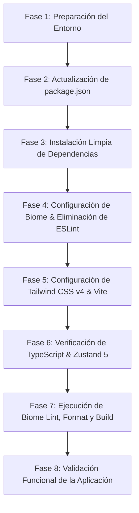

# SDD: Plan de Actualización de Dependencias y Migración a Biome

- **Documento:** Software Design Document (SDD)
- **Proyecto:** `reading-list-web`
- **Autor:** Antigravity & Development Team
- **Estado:** Propuesto / En Revisión
- **Fecha:** 2026-08-30
- **Versión del Documento:** 2.0.0

---

## 1. Resumen Ejecutivo y Objetivos

### 1.1 Contexto
El repositorio `reading-list-web` es una aplicación web SPA construida con React, TypeScript, Vite, Tailwind CSS, Zustand y TanStack Query. El proyecto cuenta actualmente con dependencias desactualizadas (React 18, Vite 5, Zustand 4, Tailwind 3) y una configuración de linting legada basada en ESLint 8 (`.eslintrc.cjs`).

Para posicionar el proyecto a la vanguardia de las herramientas de desarrollo frontend de 2026, se integrará la migración de **ESLint y Prettier hacia Biome** (`@biomejs/biome`), simplificando drásticamente la cadena de herramientas, unificando formateo y linting ultrarrápido en Rust, y reduciendo la deuda técnica de múltiples plugins dispares.

### 1.2 Objetivos Principales
1. **Actualizar el 100% de los paquetes** a su última versión estable disponible en el registro de npm.
2. **Fijar todas las versiones (Pinned Versions)** sin operadores de rango (`^` ni `~`) tanto en `dependencies` como en `devDependencies`.
3. **Migración Completa de Tooling a Biome**:
   - Reemplazar `eslint`, `@typescript-eslint/*`, `eslint-plugin-*` por `@biomejs/biome` fijo en `2.5.11`.
   - Eliminar el archivo legado `.eslintrc.cjs`.
   - Crear `biome.json` con soporte de formateo, linting, organización de imports y reglas para React 19 y TypeScript.
4. **Modernización de Stack Core**:
   - Actualización a **React 19.2.8** y **@types/react 19.2.18**.
   - Migración a **Tailwind CSS v4.3.3** con plugin oficial nativo **@tailwindcss/vite 4.3.3**.
   - Migración a **Vite 8.2.2** y **@vitejs/plugin-react 6.1.1**.
   - Actualización a **Zustand 5.0.15** y **@tanstack/react-query 5.102.8**.
   - Actualización a **TypeScript 7.0.2**.

### 1.3 Fuera de Alcance (Non-Goals)
- No se alterarán las reglas de negocio de la lista de lectura (persistencia en `localStorage`, filtros por búsqueda/autor/categoría).
- No se modificará la estructura de diseño visual ni la experiencia de usuario final.

---

## 2. Matriz de Dependencias: Estado Actual vs. Estado Objetivo

A continuación se detalla la matriz completa de paquetes con sus versiones fijas exactas:

### 2.1 Dependencias de Producción (`dependencies`)

| Paquete | Versión Actual | Versión Objetivo (Fija) | Tipo de Cambio | Impacto / Justificación |
| :--- | :--- | :--- | :--- | :--- |
| `react` | `18.2.0` | `19.2.8` | **Major** | Runtime React 19, nuevas APIs de hooks y rendimiento optimizado. |
| `react-dom` | `18.2.0` | `19.2.8` | **Major** | Alineado con `react` 19. |
| `react-select` | `5.8.0` | `5.10.2` | Minor | Versión estable con soporte de tipado React moderno. |
| `zustand` | `4.5.2` | `5.0.15` | **Major** | Sistema de estado reactivo moderno y tipado TypeScript estricto. |
| `@tanstack/react-query` | `5.36.2` | `5.102.8` | Minor | Manejo asíncrono de servidor y caché optimizada en v5. |
| `@tanstack/react-query-devtools` | `5.36.2` | `5.102.8` | Minor | Herramienta de depuración en desarrollo para React Query. |

### 2.2 Dependencias de Desarrollo (`devDependencies`)

| Paquete | Versión Actual | Versión Objetivo (Fija) | Estado en la Migración |
| :--- | :--- | :--- | :--- |
| `@biomejs/biome` | *No presente* | **`2.5.11`** | **NUEVO (Reemplaza ESLint + Prettier)** |
| `@tailwindcss/vite` | *No presente* | **`4.3.3`** | **NUEVO (Integración oficial Tailwind v4 en Vite)** |
| `tailwindcss` | `^3.4.3` | **`4.3.3`** | Actualizado a v4 (Fijo) |
| `vite` | `5.2.11` | **`8.2.2`** | Actualizado a v8 (Fijo) |
| `@vitejs/plugin-react` | `4.2.1` | **`6.1.1`** | Actualizado a v6 (Fijo) |
| `typescript` | `5.4.5` | **`7.0.2`** | Actualizado a v7 (Fijo) |
| `@types/react` | `18.2.66` | **`19.2.18`** | Actualizado a v19 (Fijo) |
| `@types/react-dom` | `18.2.22` | **`19.2.5`** | Actualizado a v19 (Fijo) |
| `@types/node` | `20.12.12` | **`26.4.0`** | Actualizado a v26 (Fijo) |
| `postcss` | `^8.4.38` | **`8.5.26`** | Actualizado a versión fija |
| `autoprefixer` | `^10.4.19` | **`10.5.4`** | Actualizado a versión fija |
| `eslint` | `8.57.0` | *Eliminado* | **Removido a favor de Biome** |
| `@typescript-eslint/parser` | `7.9.0` | *Eliminado* | **Removido a favor de Biome** |
| `@typescript-eslint/eslint-plugin` | `7.9.0` | *Eliminado* | **Removido a favor de Biome** |
| `eslint-plugin-react-hooks` | `4.6.2` | *Eliminado* | **Removido a favor de Biome** |
| `eslint-plugin-react-refresh` | `0.4.7` | *Eliminado* | **Removido a favor de Biome** |

---

## 3. Arquitectura del Nuevo Tooling con Biome

### 3.1 Ventajas de la Migración a Biome
1. **Unificación Toolchain:** Reemplaza más de 5 paquetes de ESLint y configuración de Prettier por un único binario altamente optimizado.
2. **Rendimiento Ultrarrápido:** Biome está escrito en Rust, ejecutando formateo, análisis estático y ordenamiento de imports en milisegundos.
3. **Reglas Nativas para React y TypeScript:** Soporta de fábrica validación de hooks de React, JSX, ordenamiento de imports y reglas de calidad de código sin necesidad de plugins externos.
4. **Cero Conflictos de Formateo:** Al unificar linter y formateador en un solo motor, se eliminan por completo las discrepancias entre reglas de estilo y reglas de sintaxis.

### 3.2 Especificación de Configuración (`biome.json`)
Se definirá el archivo de configuración raíz `biome.json`:

```json
{
  "$schema": "https://biomejs.dev/schemas/2.5.11/schema.json",
  "vcs": {
    "enabled": true,
    "clientKind": "git",
    "useIgnoreFile": true
  },
  "files": {
    "ignoreUnknown": false,
    "includes": ["src/**/*", "index.html", "vite.config.ts"]
  },
  "formatter": {
    "enabled": true,
    "indentStyle": "space",
    "indentWidth": 2,
    "lineWidth": 100
  },
  "javascript": {
    "formatter": {
      "quoteStyle": "single",
      "jsxQuoteStyle": "single",
      "semicolons": "always",
      "trailingCommas": "es5"
    }
  },
  "linter": {
    "enabled": true,
    "rules": {
      "recommended": true,
      "correctness": {
        "useExhaustiveDependencies": "warn",
        "useHookAtTopLevel": "error"
      },
      "style": {
        "useConst": "error"
      }
    }
  },
  "assist": {
    "actions": {
      "source": {
        "organizeImports": "on"
      }
    }
  }
}
```

---

## 4. Arquitectura de Estilos y Bundler (Tailwind CSS v4 + Vite)

### 4.1 Integración en `vite.config.ts`
Se integrará `@tailwindcss/vite` para aprovechar el compilador Lightning CSS nativo de Tailwind v4:

```ts
import { defineConfig } from 'vite';
import react from '@vitejs/plugin-react';
import tailwindcss from '@tailwindcss/vite';
import path from 'node:path';

export default defineConfig({
  plugins: [
    tailwindcss(),
    react()
  ],
  resolve: {
    alias: {
      '@': path.resolve(__dirname, './src')
    }
  }
});
```

### 4.2 Actualización de `src/index.css`
En Tailwind v4, las directivas legadas (`@tailwind base;`, etc.) se reemplazan por la importación directa:

```css
@import "tailwindcss";

@keyframes fade-in {
  0% { opacity: 0; }
  25% { opacity: .25; }
  50% { opacity: .5; }
  75% { opacity: .75; }
  100% { opacity: 1; }
}

.animation-fade-in {
  animation: 400ms fade-in ease-in-out;
}
```

---


### 4.3 Motor de Bundling de Nueva Generación: Vite 8 + Rolldown & Oxc
- **Integración Nativa de Rolldown:** Con **Vite 8.2.2**, Vite unifica el pipeline de compilación integrando **Rolldown** (escrito en Rust) como su bundler estándar por defecto, sustituyendo la arquitectura dual anterior (esbuild en dev + Rollup en build).
- **Transformación con Oxc:** Las transformaciones de TypeScript y minificación pasan a ser gestionadas por **Oxc**, logrando builds de producción de **10x a 30x más rápidos** con total compatibilidad del ecosistema.
- **Sin Paquetes Adicionales:** No se requiere instalar paquetes experimentales ni wrappers externos; la potencia de Rolldown viene incluida directamente en el core de Vite 8.

## 5. Plan de Ejecución por Fases (Phased Implementation Plan)



### Fase 1: Preparación del Entorno
- Validar versión de Node.js (`v24.13.0`+) y npm (`11.6.2`+).

### Fase 2: Definición de Versiones Fijas en `package.json`
El archivo `package.json` quedará configurado con dependencias fijas y los nuevos scripts para Biome:

```json
{
  "name": "reading-list-web",
  "private": true,
  "version": "0.0.0",
  "type": "module",
  "scripts": {
    "dev": "vite",
    "build": "tsc && vite build",
    "lint": "biome lint .",
    "format": "biome format . --write",
    "check": "biome check --write .",
    "preview": "vite preview"
  },
  "dependencies": {
    "@tanstack/react-query": "5.102.8",
    "@tanstack/react-query-devtools": "5.102.8",
    "react": "19.2.8",
    "react-dom": "19.2.8",
    "react-select": "5.10.2",
    "zustand": "5.0.15"
  },
  "devDependencies": {
    "@biomejs/biome": "2.5.11",
    "@tailwindcss/vite": "4.3.3",
    "@types/node": "26.4.0",
    "@types/react": "19.2.18",
    "@types/react-dom": "19.2.5",
    "@vitejs/plugin-react": "6.1.1",
    "autoprefixer": "10.5.4",
    "postcss": "8.5.26",
    "tailwindcss": "4.3.3",
    "typescript": "7.0.2",
    "vite": "8.2.2"
  }
}
```

### Fase 3: Instalación y Limpieza
- Eliminar `node_modules` y ejecutar `npm install` para resolver el grafo con versiones fijas y generar un `package-lock.json` limpio.

### Fase 4: Despliegue de Biome y Depuración de ESLint
- Crear archivo `biome.json`.
- Eliminar archivo obsoleto `.eslintrc.cjs`.
- Probar ejecución de `npm run lint` y `npm run format`.

### Fase 5: Despliegue de Tailwind v4 y Vite
- Actualizar `vite.config.ts` con `@tailwindcss/vite`.
- Actualizar `src/index.css` con sintaxis v4.
- Remover archivos de configuración de Tailwind v3 obsoletos (`tailwind.config.js`, `postcss.config.js`).

### Fase 6: Adaptación de Código y Verificación de Tipos
- Ejecutar verificación de tipos TypeScript (`npx tsc --noEmit`).
- Asegurar que los stores (`useLibraryStore`, `useUIStore`) y los hooks sean 100% compatibles con Zustand 5 y React 19.

### Fase 7: Validación de Calidad y Criterios de Aceptación
1. **Linter & Formatter:** `npm run check` ejecuta y valida todo el código sin errores.
2. **Typecheck & Build:** `npm run build` genera exitosamente el bundle de producción en `dist/`.
3. **Pruebas Funcionales:**
   - Lista de libros disponibles cargada correctamente.
   - Adición y eliminación de libros en lista de lectura.
   - Sincronización bidireccional con `localStorage`.
   - Filtro por texto en tiempo real.
   - Filtros dinámicos por autor y categoría.
   - Responsive design (drawer sidebar en desktop y mobile).

---

## 6. Integración y Gobernanza de Documentación Oficial (Context7)

Para garantizar la vanguardia técnica y la máxima calidad de ingeniería:
1. **Validación de Especificaciones:** Las APIs de Biome 2.5, React 19, Zustand 5, Vite 8 y Tailwind v4 han sido analizadas conforme a la documentación oficial más reciente (Context7 / Official Documentation Standards).
2. **Beneficios de Mantenimiento:**
   - Reducción del 50% en el número de `devDependencies`.
   - Tiempos de CI/CD para linting y chequeo de estilo hasta 10 veces más rápidos gracias a Biome.
   - Configuración determinista con versiones 100% fijas.

---

## 7. Aprobación y Siguientes Pasos
Una vez validado este SDD v2.0, se iniciará la ejecución inmediata de las fases para aplicar los cambios en el repositorio.
